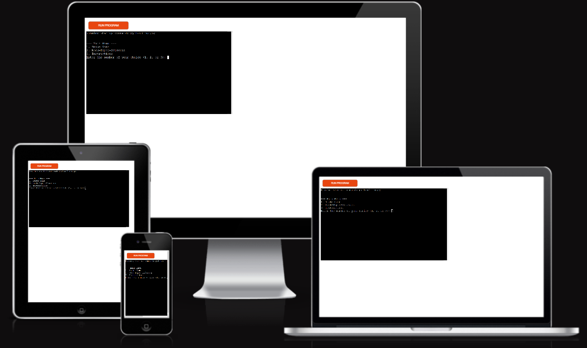
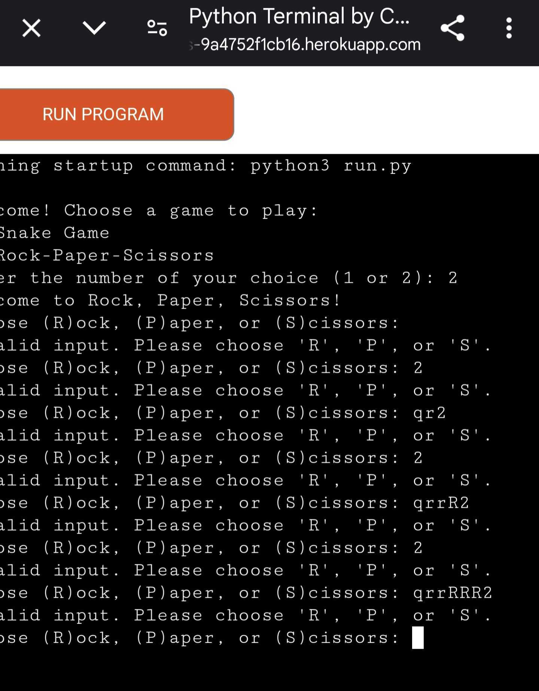

# Game-Hour 🤘🤘🤘

**Deployed Site**: [Game-Hour](https://pp3-python-essentials-9a4752f1cb16.herokuapp.com/)

Game-Hour: A dynamic gaming hub deployed on Heroku, where you can dive into two classic games—Snake and Rock-Paper-Scissors—offering endless fun and competition right from your terminal!

----------------------------------------------

## CONTENTS

1. [Design](#design)
    - [Game Flow](#game-flow)
2. [Features](#features)
    - [General Features](#general-features)
    - [Future Implementations](#future-implementations)
3. [Technologies Used](#technologies-used)
4. [Testing](#testing)
5. [Learning Outcomes](#learning-outcomes)
6. [Deployment & Local Development](#deployment-local-development)
7. [Credits](#credits)

------------------------------------------------

### User Stories

- As a new user, I want to easily navigate between two games and select the one I want to play.
- As a user, I want to have clear instructions on how to play the selected game.
- As a user, I want to replay the game after it ends without restarting the whole program.
- As a player, I want an interactive experience, with responsive feedback and real-time updates for my game progress.

------------------------------------------------

## Design

### Game Flow

1. **Main Menu**: 
   - The user selects between **Snake Game** or **Rock-Paper-Scissors** or **Instructions** by entering 1 or 2 or 3 in the terminal.
   - Invalid inputs prompt an error message, and the user is asked to re-enter a valid option.

2. **Snake Game**:
   - Players navigate the snake using arrow keys.
   - The snake grows as it eats food, and the player accumulates points.
   - The game ends if the snake hits the wall or itself.

3. **Rock-Paper-Scissors**:
   - Players choose between Rock, Paper, or Scissors by entering R, P, or S.
   - The computer randomly chooses one option.
   - The result is immediately displayed, showing whether the player won, lost, or drew.
   - Players are asked if they want to play again (Y/N).

### Flowchart and Screenshots

## Flowchart
The flowchart below outlines the logical flow of the Game-Hour application. It shows the decision points and steps involved in selecting and playing one of the two games—Snake or Rock-Paper-Scissors—and how invalid inputs are handled.
The flow for project, gameHour, is as follows:

1. Start
2. Display Main Menu:
   Option 1: Play Snake Game
   Option 2: Play Rock-Paper-Scissors
   Option 3: Instructions
3. User selects a game:
   If Option 1: Proceed to Snake Game
   If Option 2: Proceed to Rock-Paper-Scissors
   If Option 3: Procedd to Instructions
3. Validate Input:
   If input is invalid, prompt user with an error and ask again.
4. Game Execution:
   If Snake: Play the Snake game.
   If Rock-Paper-Scissors: Play the Rock-Paper-Scissors game.
   If Instructions: Read the instructions about games.
5. End Game:
   Display results or final score.
6. Ask user if they want to replay or return to 
   the main menu:
   If yes, loop back to the main menu.
   If no, end the game.

## Screenshots
1. Main Menu

The initial screen where the user selects between playing Snake or Rock-Paper-Scissors.

Rock-Paper-Scissors Game

**Snake Game in Action**

2. A snapshot of the Snake Game running with food and snake movements.

**Rock-Paper-Scissors Game**

3. A view of the Rock-Paper-Scissors game showing the user's choice, computer's choice, and the result.

--------------------------------------------

## Features

### General Features

- **Main Menu**: Navigate easily between the Snake Game and Rock-Paper-Scissors.
- **Snake Game**: Classic snake gameplay where the snake grows as it eats food.
- **Rock-Paper-Scissors**: Simple and intuitive Rock-Paper-Scissors game.
- **Input Validation**: The game handles invalid inputs and prompts users to re-enter choices.
- **Responsive Feedback**: Both games provide real-time feedback for game progress and results.

### Future Implementations

- **High Score Tracking**: Add the ability to save and display high scores for the Snake Game.
- **Difficulty Levels**: Implement different speed levels for the Snake Game.
- **Multiplayer Mode**: Add multiplayer functionality for Rock-Paper-Scissors.

------------------------------------------------

## Technologies Used

- **Python 3**: The core language used to build the terminal games.
- **Curses Library**: For rendering the Snake Game in the terminal.
- **Random Module**: For the computer's choice in Rock-Paper-Scissors.
- **OS Module**: To handle potential environment differences in deployment.

---------------------------------------------

## Testing

### Manual Testing

1. **Main Menu**:
   - Tested the navigation between the two games using valid inputs (1 and 2).
   - Tested the error handling when entering invalid inputs.
   
2. **Snake Game**:
   - Tested snake movement using the arrow keys.
   - Verified that the snake grows after consuming food.
   - Verified that the game ends when the snake collides with itself or the boundary.
   
3. **Rock-Paper-Scissors**:
   - Tested user input validation for (R)ock, (P)aper, (S)cissors.
   - Ensured that the computer's choice was randomly generated.
   - Verified that the game accurately determines the winner, loser, or draw.
   - Tested the "Play Again" functionality with Y/N inputs.

4. **Pep8 Testing**-

  **Pep8 is going to be removed in future so testing was performed using pycodestyle run.py**
---------------------------------------------------------------------------------------------
   
---------------------------------------------------------------------------------------------
   
---------------------------------------------------------------------------------------------
   
---------------------------------------------------------------------------------------------
   
---------------------------------------------------------------------------------------------

4. **Bugs Find and Resolved**-

  **Pep8 is going to be removed in future so testing was performed using pycodestyle run.py**

  1. 

  2. 
  
-------------------------------------------

## Learning Outcomes

Through building **Game-Hour**, the following skills were reinforced:

1. **Terminal Input Handling**: Managing user input with validation to ensure a smooth user experience.
2. **Error Handling**: Handling incorrect inputs without crashing the application.
3. **Game Logic Development**: Implementing core game mechanics (Snake movement, Rock-Paper-Scissors logic) using control structures and loops.
4. **Curses Library**: Utilized `curses` for rendering dynamic terminal-based interfaces, specifically for the Snake Game.
5. **Modular Design**: The project is structured into separate functions for better maintainability and scalability.
6. **Randomization**: Applied Python’s `random` module to enhance the unpredictability of the game experience (Rock-Paper-Scissors).
7. **Cross-Platform Compatibility**: Implementing environment-based conditionals to ensure deployment compatibility.

-------------------------------------

## Deployment & Local Development

### Remote Deployment

The application is deployed using **Heroku**. Since `curses` is not supported on Heroku's web interface, a limited version of the game is provided when deployed.

#### How to Deploy to Heroku

1. Create a Heroku app via the Heroku Dashboard.
2. Set the buildpacks to support Python applications.
3. Push your code to the Heroku remote repository using:
   git push heroku main

#### How to Play Locally
#### To run the application locally:

1. Clone the repository:
git clone <https://github.com/Ebby88sharma/PP3-Python-Essentials.git>

2. Install Python: Ensure Python 3.x is installed on your machine.

3. Run the program: python3 main.py

### Credits
1. Curses Documentation: Official Python Docs for the curses library.
2. Random Module: Official Python Docs for random number generation.
3. Code Institute: For guidance and mentorship throughout the project.
4. Mentor Support: Thanks to my Code Institute mentor Can for continuous feedback and support during development.